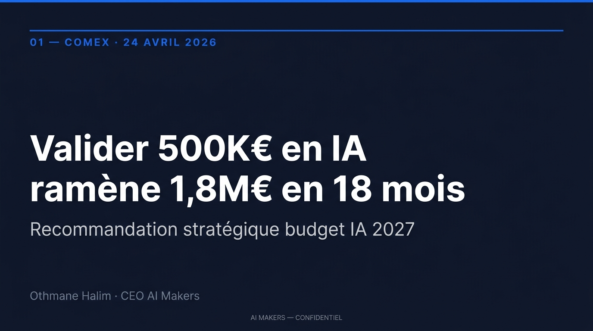
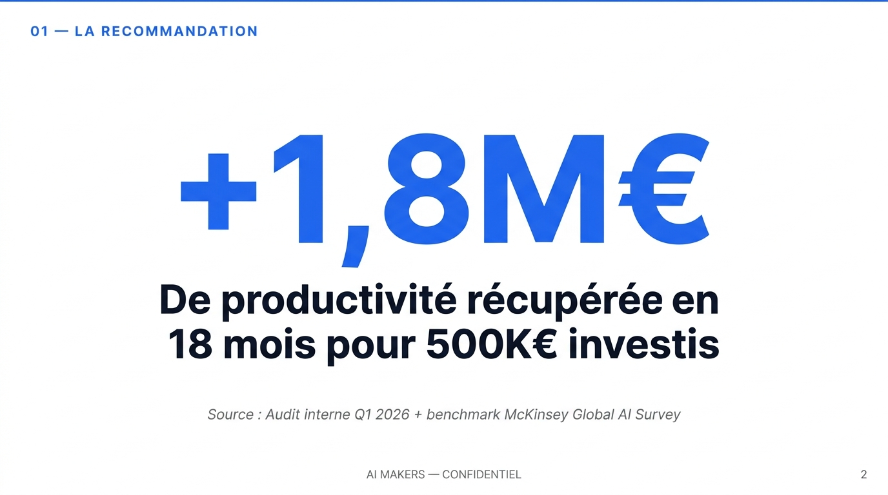
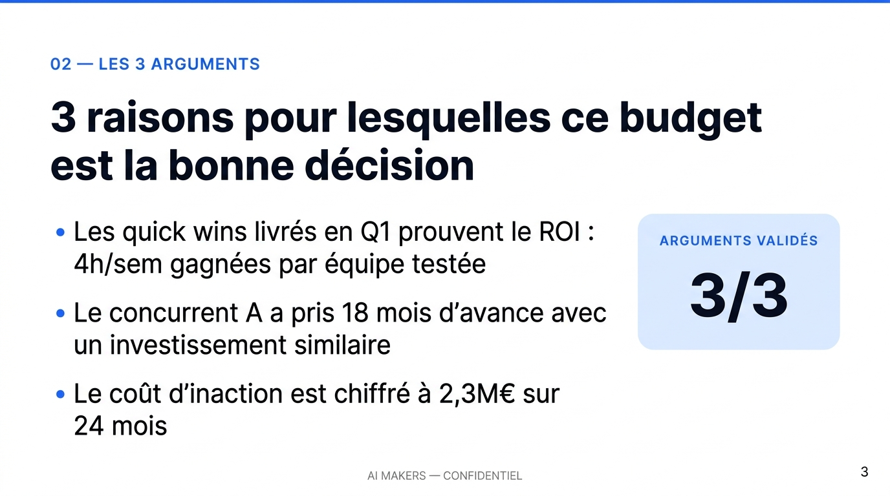

# claude-deck-skills

**3 skills Claude Code pour générer des présentations COMEX-ready en 15 minutes, à tes couleurs.**

Arrête de perdre 3h sur chaque deck investisseur / COMEX. Arrête d'envoyer des exports Gamma génériques reconnaissables à 10 mètres. Génère des presentations qui passent le headline test et convertissent.

Par [AI Makers](https://aimakers.fr) — cabinet de transformation IA.

> 📖 **Tu veux la méthode complète avant d'installer ?** Lis le playbook gratuit (35 min) :
> 👉 **[Le Playbook Deck AI-First](https://acute-licorice-d94.notion.site/Le-Playbook-Deck-AI-First-34cc2daa75c781fd8568cd21b285f03d)** — les 10 prompts, les 14 tactiques niveau pro, la méthode d'injection de charte à 3 niveaux, la FAQ.

---

## 🎬 Le résultat — 3 slides du deck démo

Voilà ce que `npm run demo` produit en 5 secondes (charte AI Makers : AI Blue #2563EB + Inter) :

**Slide 1 — Cover (fond sombre, overline AI Blue)**


**Slide 2 — Hero number (1 chiffre massif = 1 message)**


**Slide 3 — Three bullets + data callout (structure Minto)**


Pas de "AI look" Gamma. Pas de template générique. Juste ta charte, ton logo, tes slides.

---

## Ce que ça fait

3 skills qui se chaînent pour couvrir le cycle complet de création d'un deck :

| Skill | Rôle | Output |
|---|---|---|
| `/deck-story` | Pré-production — audience analysis, 3 angles narratifs, ghost deck | `ghost-deck.md` |
| `/deck-build` | Production — génération .pptx branded via PptxGenJS | `deck.pptx` |
| `/deck-review` | Post-production — scoring + multi-persona + Q&A prep + pre-wire | `review.md` |

Temps total pour un deck COMEX complet : **15-20 minutes** au lieu de 2-3h.

---

## Install en 1 commande

```bash
git clone https://github.com/othmane-droid/claude-deck-skills.git ~/.claude/skills/deck
cd ~/.claude/skills/deck
npm install
cp charte-graphique.example.json charte-graphique.json
# Édite charte-graphique.json avec tes couleurs / polices / logo
```

Recharge Claude Code → les 3 skills sont disponibles : `/deck-story`, `/deck-build`, `/deck-review`.

**Prérequis :** Node.js 18+, Claude Code installé ([doc](https://docs.anthropic.com/en/docs/claude-code)), testé avec Claude Code ≥ 1.0.

> 👤 **Tu es non-tech et tu veux déléguer à ton dev ?** Copie-colle cet email :
>
> *"Salut — installe-moi ce repo dans `~/.claude/skills/deck` : https://github.com/othmane-droid/claude-deck-skills — prérequis Node 18+ et Claude Code. Étapes dans le README (install en 1 commande + `npm run demo` pour valider). Ping-moi quand la démo génère un .pptx sans erreur. Merci."*

---

## Demo en 5 secondes

```bash
npm run demo
```

Génère `examples/deck-demo-aimakers.pptx` — un deck COMEX de 8 slides aux couleurs AI Makers (AI Blue #2563EB + Inter). Ouvre-le dans PowerPoint / Keynote pour voir ce que produit le stack.

---

## Exemple d'usage complet

```
# Dans Claude Code :

/deck-story "Je dois défendre 500K€ de budget IA devant mon COMEX la semaine prochaine"
# → Claude pose 5 questions, propose 3 angles narratifs, tu choisis, ghost deck généré

/deck-build
# → .pptx aux couleurs de ta charte dans ./output/

/deck-review deck.pptx
# → Score, top 3 fixes, 15 Q&A prep, pre-wire plan 48h
```

---

## Configurer ta charte graphique

Copie `charte-graphique.example.json` en `charte-graphique.json` et édite :

```json
{
  "couleurs": {
    "principale": "2563EB",
    "noir_tech": "0F172A",
    "accents_clairs": "DBEAFE",
    "vert_succes": "10B981"
  },
  "polices": {
    "principale": "Inter",
    "titre_poids": "bold"
  },
  "logo": {
    "chemin": "./assets/logo.png",
    "largeur_cm": 2.5
  }
}
```

Chaque deck généré respectera tes couleurs, ta police, ton logo. Pas de "AI look" Gamma.

---

## Les 10 prompts COMEX-ready

Le repo embarque aussi les 10 prompts testés du [Playbook Deck AI-First](https://acute-licorice-d94.notion.site/Le-Playbook-Deck-AI-First-34cc2daa75c781fd8568cd21b285f03d) dans `skills/deck-story/prompts/` :

1. Deck COMEX stratégique (Minto)
2. Deck d'audit client (SCR)
3. Pitch investisseur série A (Kawasaki 10/20/30)
4. Launch produit (Pixar Story)
5. Deck sales B2B (Before-After-Bridge)
6. One-pager exécutif (BLUF)
7. Recommandation 3 options (Options-Tradeoffs)
8. QBR résultats trimestriels (5S)
9. Deck de formation (Tell-Show-Do)
10. Post-mortem / crise (4-Whats)

---

## Pourquoi c'est différent de Gamma / Beautiful.ai

| | claude-deck-skills | Gamma / Beautiful.ai |
|---|---|---|
| Charte respectée à 100% | ✅ (hex, polices, logo injectés) | Partiellement |
| Action titles obligatoires | ✅ | ❌ |
| Ghost deck avant body | ✅ | ❌ |
| Self-critique automatique | ✅ | ❌ |
| Multi-persona stress test | ✅ | ❌ |
| Q&A prep automatique | ✅ | ❌ |
| Pre-wire strategy | ✅ | ❌ |
| Reproductible en volume | ✅ | ❌ |
| Gratuit, open-source, forkable | ✅ (MIT) | ❌ |

---

## 🚨 Ça marche pas ? (troubleshooting express)

| Problème | Fix en 30 secondes |
|---|---|
| `Cannot find module 'pptxgenjs'` | `cd` dans le dossier du repo puis `npm install` |
| Le `.pptx` se génère mais sans logo | Normal si `charte.logo.chemin` = `null`. Ajoute un logo dans `./assets/` et renseigne le chemin dans `charte-graphique.json` |
| `Font 'Inter' not available` | Installer [Inter via Google Fonts](https://fonts.google.com/specimen/Inter) sur ton système ou remplacer par `"Arial"` dans la charte |
| Les skills `/deck-*` ne sont pas détectés par Claude Code | Vérifier que le dossier est bien cloné dans `~/.claude/skills/` et relancer Claude Code |
| Le deck généré est vide | `npm run demo` d'abord pour valider l'install avant de brancher ta vraie charte |

Plus de cas → voir [docs/install.md](docs/install.md).

---

## Contribuer

Le repo est MIT. Fork, modifie, utilise commercialement dans tes propres prestations.

- **Nouveau framework narratif** → PR sur `skills/deck-story/frameworks/`
- **Nouveau layout visuel** → PR sur `skills/deck-build/scripts/layouts.js`
- **Nouveau persona pour stress test** → PR sur `skills/deck-review/personas/`
- **Bug ou question** → ouvre une [issue](https://github.com/othmane-droid/claude-deck-skills/issues)

Voir [CONTRIBUTING.md](CONTRIBUTING.md) pour les guidelines.

---

## Ressources

- **Playbook complet** (25 min de lecture, gratuit) : [Le Playbook Deck AI-First](https://acute-licorice-d94.notion.site/Le-Playbook-Deck-AI-First-34cc2daa75c781fd8568cd21b285f03d)
- **AI Makers** (cabinet de transformation IA) : [aimakers.fr](https://aimakers.fr)
- **Claude Code** : [docs.anthropic.com/en/docs/claude-code](https://docs.anthropic.com/en/docs/claude-code)
- **PptxGenJS** : [github.com/gitbrent/PptxGenJS](https://github.com/gitbrent/PptxGenJS)

---

## License

MIT. Voir [LICENSE](LICENSE).

---

Fait avec ☕ par [Othmane Halim](https://www.linkedin.com/in/othmanehalim/) et l'équipe AI Makers.

**Tu veux qu'on installe cette stack chez toi et forme ton équipe ?** → [cal.com/othmane-halim-5lo7uc/30min](https://cal.com/othmane-halim-5lo7uc/30min)
